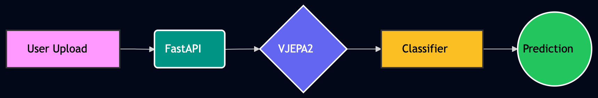

# vjepa-video-understanding-app
A full-stack video understanding web application built using VJEPA2, a self-supervised video world model developed by Meta AI. The system extracts latent video representations and performs downstream action classification through a trained neural head.

## Deployment

VISIT https://huggingface.co/spaces/haujla2391/VJEPA2

## Architecture

## Techstack

* PyTorch
* FastAPI
* React / HTML
* Self-Supervised Learning
* Video Representation Learning
